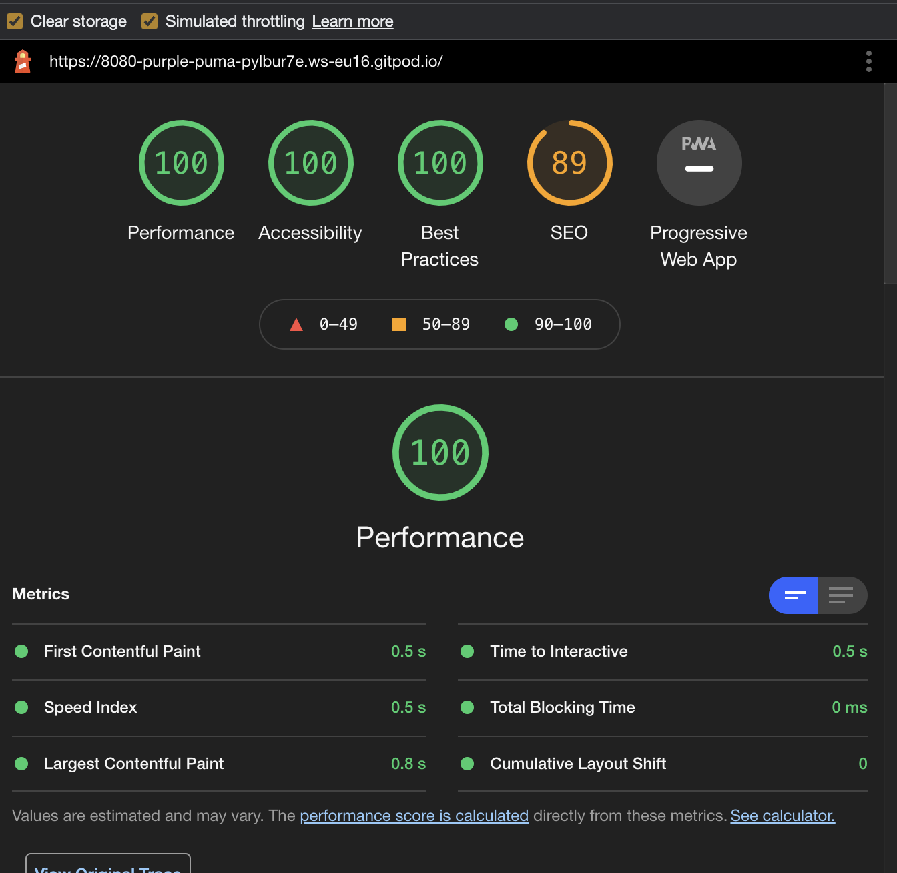

# Memo-It

You have gone to the fridge and wonder why you stood there, you have gone to the stores and come back with everything but the thing you were looking for. Life is busy, and sometimes you need that little extra hint. The Memo-It will keep everything organized.  The Memo-It will keep all them little but important things to remember. Bring attention to the things you need to do, remember them and complete them. I find when you make a list, you are more inclined to take action and complete the task. Brief and to the point. This can be used by everyone. 

The live link can be found here - https://nedduc.github.io/Memo-It/

## Features 

### Existing Features

- __Heading__

  - Memo-It text and background image of paper wireframe plans.

- __Time of Day Greeting__

  - Depending on the time of day you open this, it will read "Good morning" "Good day" or "Good evening".

- __Date__

  - Showing currect date.

- __Erase icon__

  - Top right hand side, icon of eraser can be clicked to erase entire list.

- __The landing page__

  - Simple, unclutterd landing page colours inspired by pantone 2021 colours
  - Good layout of page items.

- __The input window__ 

  - When the page opens the cursor has been placed into the window input area so the user can immediately start typing a memo. 
  - The input window has place holder text reading 'Type task and hit enter' inserted to give user advice on what to do. The text colour has been lightened so the user knows it's a place to fill in text. 
  - If you do not enter text in this window and hit the enter key nothing will happen, you cannot have a empty line of text.

- __Font Awesome__

  - Icons used to indicate where to write, complete and delete.
  - https://fontawesome.com/

### Features Left to Implement

- Other features to implement to create three icon links to seperate Memo-It list into work, rest and play.
- Drag and drop feature for moving tasks between different lists.
- Set up local storage for items to remain on list until deleted.
- Sound effect on completed item.

## Testing 

Checks carried out on spelling, grammar and Punctuation. Most of the spelling and grammar will be inserted by user. I made sure that the input field worked and the item inserted would appear on the list. Title tags and meta data have good description for SEO.

Responsive on all screen sizes from desktop to mobile, media query added for mobile to give more real estate to keyboard for data entry. I have also included vertical scroll bar.

I discovered that on the toggle within javascript it did not like dealing with the font awesome icons that have a space. All variables used, have to be defined. Unexpected tokens are not allowed.

Bugs screen shots located in readme folder, they have been resolved. 

### Validator Testing 

- HTML
  - No errors were returned when passing through the official [W3C validator](https://validator.w3.org/)
- CSS
  - No errors were found when passing through the official [(Jigsaw) validator](https://jigsaw.w3.org/css-validator/)
- JSHint
  - No errors were found when passing through the official [(JSHint) validator](https://jshint.com/)
- Lighthouse
  - Overall report was 100%  /workspace/Memo-It/testing/Lighthouse-Report.png
- DevTools
  - Responsiveness on all devices.

 

### Unfixed Bugs
I was able to remove all bugs as they were easy enough to fix, once I did a bit of research to find out what each bug meant, most of my research was done on https://stackoverflow.com/ and https://www.w3schools.com/

 

## Deployment

In order for someone to access, I must deploy site to Github from Gitpod the container-based development platform I have been using: 
  - Make sure that I have "git added", "git commit -m" & "git push" to Github
  - Once in Github, I navigated to my sites repository - https://github.com/nedduc
  - Under my repository name, to the right of the screen click  Settings.
  - Under my repository name, to the right of the screen click Settings.
  - In the left sidebar, click Pages.
  - Under “GitHub Pages”, use the None or Branch drop-down menu and select a publishing source.
  - Optionally, use the drop-down menu to select a folder for my publishing source. 

The live link can be found here - https://nedduc.github.io/Memo-It/

## Credits 
(https://www.w3schools.com/)(https://www.youtube.com/channel/UC8n8ftV94ZU_DJLOLtrpORA)
(https://fontawesome.com/)(Patient and kind tutors from Code Institute)

### Content 

- The icons on the page were taken from [Font Awesome](https://fontawesome.com/)

### Media

- The header image Photo by Sigmund on Unsplash https://unsplash.com/